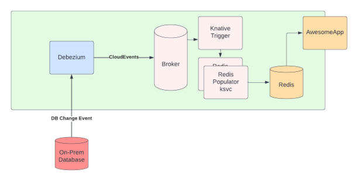

# Sample Debezium Knative Integration

Here lies a sample integration of [Debezium](https://debezium.io) with [Knative](https://knative.dev) as presented at Knative Con EU 2022.

The basic premise is to show a real world example for how to capture database
changes from Debezium, convert to a Knative service that can stream the database
changes as events, and do something useful. In this case, pluck out a couple of
attributes and store them in redis where a second service will read the data and
publish it as a web service.

# Working with the Demo

A stock version of the Debezium server should be enough to get the demo functional
provided it is 1.9 or better. To do so, update the [Debezium Service Capturer](kubeconfigs/400-debezium-service.yaml), and change the image to `docker.io/debezium/server:latest`.

The demo relies on two anciallary services: [ce-interceptor](./ce-interceptor)
and [redis-retriever](./redis-retriever). To build these services, enter into
their respective directories, and run
    pushd ce-interceptor && docker build --tag <myrepo>/ce-interceptor:latest . && popd
    pushd redis-retriever && docker build --tag <myrepo>/redis-retriever:latest . && popd

Be sure to update the service images in [kubeconfigs](./kubeconfigs) directory.

Note, in the kubeconfigs directory, there are two ways to run Debezium:
1. [Debezium as a Knative service](./kubeconfigs/400-debezium-service.yaml)
1. [Debezium as a Deployment](./kubeconfigs/410-debezium-deployment.yaml)

Regardless of the approach, both leverage Knative's SinkBinding to ensure the
events find their way into the Broker.

Lastly, the Debezium configuration includes details such as how to connect to your
on-prem database. Be sure to edit the [configmap](./kubeconfigs/100-configmap.yaml)
to include the necessary credentials. Alternatively, you can follow the pattern
in the [400-debezium-service.yaml](./kubeconfigs/400-debezium-service.yaml) to
configure Debezium. This will give you added protection on your secrets, but
does make the Debezium service manifest more complex.

To install inside your own cluster, running `kubectl apply -f ./kubeconfigs`
will be enough to load up all services.

To learn more or reach out, visit [Atelier Solutions](https://atelier-solutions.com/debezium-knative-2022)
